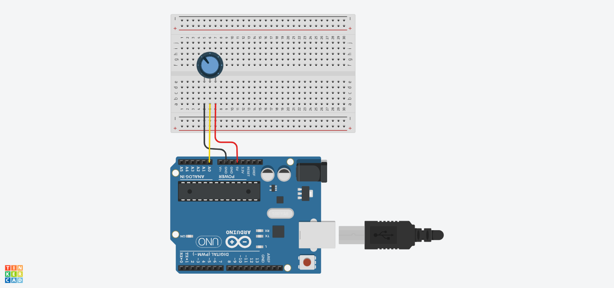

# Basics - Analog Read Serial

- [Doc Link](https://docs.arduino.cc/built-in-examples/basics/AnalogReadSerial/)

- [TinkerCad Link](https://www.tinkercad.com/things/hkrEEEyksST-built-in-examplesbasicsanalogreadserial)

