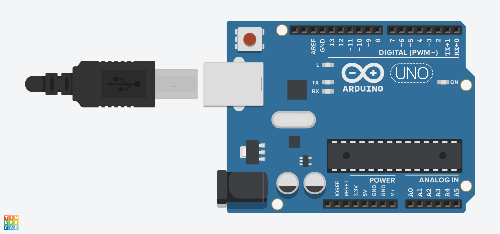

# Basics - Bare Minimum Code Needed

- [Doc Link](https://docs.arduino.cc/built-in-examples/basics/BareMinimum/)

- [TinkerCad Link](https://www.tinkercad.com/things/4ywsPqWhQ1g-built-in-examplesbasicsbareminimumcodeneeded)

