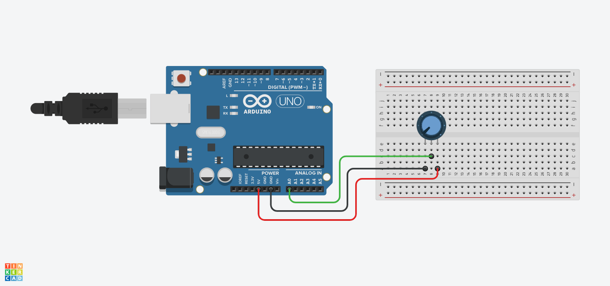

# Basics - Read Analog Voltage

- [Doc Link](https://docs.arduino.cc/built-in-examples/basics/ReadAnalogVoltage/)

- [TinkerCad Link](https://www.tinkercad.com/things/krIvsytdqBs-built-in-examplesbasicsreadanalogvoltage)

